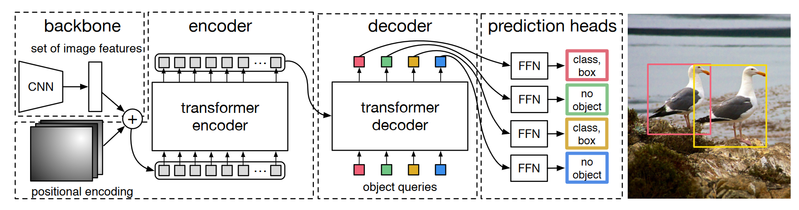
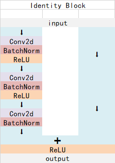

# 从头开始构建DETR网络

来自文章[End-to-End Object Detection with Transformers](https://scontent-hkg4-1.xx.fbcdn.net/v/t39.2365-6/154305880_816694605586461_2873294970659239190_n.pdf?_nc_cat=108&ccb=1-7&_nc_sid=3c67a6&_nc_ohc=7kbGRIBAKBgAX-YDqBc&_nc_ht=scontent-hkg4-1.xx&oh=00_AfDTc8IvCPPdbB9EaI5dxC1D6BX6XYXmDruSfxcmlNGttQ&oe=6521EF03)

源码参考[facebookresearch/detr](https://github.com/facebookresearch/detr)

解析参考[Bubbliiiing的CSDN](https://blog.csdn.net/weixin_44791964/article/details/128361674)

## 整体结构解析



上面这幅图是论文里的Fig. 2，比较好的展示了整个DETR的工作原理。原文中说DETR无需手工融入先验知识的结构（如NMS非极大值抑制、Anchor生成），实现端到端的目标检测，且检测结果是一次并行输出的。整个DETR可以分为四个部分，分别是：backbone、encoder、decoder以及prediction heads。

**backbone 是DETR的主干特征提取网络**，输入的图片首先会在主干网络里面进行特征提取，提取到的特征可以被称作特征层，是输入图片的特征集合。在主干部分，我们获取了一个特征层进行下一步网络的构建，这一个特征层我称它为有效特征层。

**encoder 是Transformer的编码网络-特征加强**，在主干部分获得的一个有效特征层会首先在高宽维度进行平铺 [CxHxW -> Cx(HxW)]，成为一个特征序列，然后会在这一部分继续使用Self-Attension进行加强特征提取，获得一个加强后的有效特征层。它属于Transformer的编码网络，编码的下一步是解码。

**decoder 是Transformer的解码网络-特征查询**，在encoder部分获得的一个加强后的有效特征层会在这一部分进行解码，解码需要使用到一个非常重要的可学习模块，即上图呈现的object queries。在decoder部分，我们使用一个可学习的查询向量q对加强后的有效特征层进行查询，获得预测结果。

**prediction heads 是DETR的分类器与回归器**，其实就是对decoder获得的预测结果进行全连接，两次全连接分别代表种类和回归参数。图上画了4个FFN，源码中是2个FFN。

因此，整个DETR网络所作的工作就是 **特征提取-特征加强-特征查询-预测结果**。

## models

首先由文中所述结构，构建模型

### backbone

DETR可以采用多种的主干特征提取网络，论文中用的是Resnet，本文以Resnet50网络为例子来给大家演示一下。

#### residual net

<div align=center>

</div>

残差网络，将靠前若干层的某一层数据输出直接跳过多层引入到后面数据层的输入部分。意味着后面的特征层的内容会有一部分由其前面的某一层线性贡献。

#### residual block

<div align=center>

</div>

ResNet的基础架构——残差块（residual block）。在残差块中，输入可通过跨层数据线路更快地向前传播。

#### ResNet50

ResNet50有两个基本的块，分别名为**Conv Block**和**Identity Block**，其中Conv Block输入和输出的维度是不一样的，所以不能连续串联，它的作用是改变网络的维度；Identity Block输入维度和输出维度相同，可以串联，它的作用是加深网络的。

Conv Block的结构如下，由图可以看出，Conv Block可以分为两个部分，左边部分为主干部分，存在两次卷积、标准化、激活函数和一次卷积、标准化；右边部分为残差边部分，存在一次卷积、标准化，由于残差边部分存在卷积，所以我们可以利用Conv Block改变输出特征层的宽高和通道数：

<div align=center>

</div>

Identity Block的结构如下，由图可以看出，Identity Block可以分为两个部分，左边部分为主干部分，存在两次卷积、标准化、激活函数和一次卷积、标准化；右边部分为残差边部分，直接与输出相接，由于残差边部分不存在卷积，所以Identity Block的输入特征层和输出特征层的shape是相同的，可用于加深网络：

<div align=center>

</div>

总的网络结构如下：

<div align=center>

</div>

#### 创建 BackboneBase 基类:

```python
'''
backbone：一个 PyTorch 模型，用作主干模型。
train_backbone：一个布尔值，指示是否训练主干模型的所有参数。
num_channels：一个整数，表示主干模型输出的特征图的通道数。
return_interm_layers：一个布尔值，指示是否返回主干模型的中间层输出。
'''
class BackboneBase(nn.Module):

    def __init__(self, backbone: nn.Module, train_backbone: bool, num_channels: int, return_interm_layers: bool):
        super().__init__()
        # 使用 backbone.named_parameters() 遍历主干模型的所有参数。如果 train_backbone 为 False，或者参数名称中不包含
        # 'layer2'、'layer3' 或 'layer4'，则将该参数的 requires_grad 设置为 False，即冻结对应的参数不参与训练。
        for name, parameter in backbone.named_parameters():
            if not train_backbone or 'layer2' not in name and 'layer3' not in name and 'layer4' not in name:
                parameter.requires_grad_(False)

        # 根据 return_interm_layers 的值，确定要返回的主干模型的哪些层的输出。如果 return_interm_layers 为 True，
        # 则返回所有层的输出，否则只返回最后一层（'layer4'）的输出。这些层的输出将通过 IntermediateLayerGetter 类进行提取。
        if return_interm_layers:
            return_layers = {"layer1": "0", "layer2": "1", "layer3": "2", "layer4": "3"}
        else:
            return_layers = {'layer4': "0"}
        
        # self.body 是一个 IntermediateLayerGetter 对象，它将主干模型 backbone 作为输入，并根据 return_layers 参数提取所需层的输出。
        self.body = IntermediateLayerGetter(backbone, return_layers=return_layers)
        self.num_channels = num_channels

    # 定义模型的前向传播过程。接受一个名为 tensor_list 的 NestedTensor 对象作为输入。
    def forward(self, tensor_list: NestedTensor):
        # 通过 self.body 对输入的 tensor_list.tensors（即输入张量）进行主干模型的前向计算，得到一系列的特征图输出，存储在字典 xs 中，键为层的名称。
        xs = self.body(tensor_list.tensors)
        out: Dict[str, NestedTensor] = {}

        # 遍历 xs 中的每个特征图输出，对应的输入掩码为 tensor_list.mask。通过插值操作将输入掩码与特征图输出的尺寸对齐，
        # 并将其转换为布尔类型。然后，将特征图输出和对应的掩码存储为 NestedTensor 对象，并将其添加到输出字典 out 中。
        for name, x in xs.items():
            m = tensor_list.mask
            assert m is not None
            mask = F.interpolate(m[None].float(), size=x.shape[-2:]).to(torch.bool)[0]
            out[name] = NestedTensor(x, mask)
        return out
```

**nn.Module 的 named_parameters 方法**

`nn.Module` 的 `named_parameters`方法，用于返回模型中所有可学习参数的迭代器。它返回一个迭代器，每次迭代产生一个元组，包含参数的名称和参数本身。

例如，假设有一个名为 `model` 的模型对象，可以使用 `model.named_parameters()` 来获取模型中所有参数的迭代器，然后对其进行遍历：

```python
for name, parameter in model.named_parameters():
    print(name, parameter.shape)
```

在上面的示例中，`name` 是参数的名称，`parameter` 是参数本身。可以根据需要对参数进行操作，例如打印参数的形状、设置参数的 `requires_grad` 等。

`named_parameters` 方法返回的参数名称不一定按照 "layer1"、"layer2" 的规范命名。实际上，参数的名称是根据模型的结构和定义方式来确定的。

在 PyTorch 中，模型的结构通常是由多个层组成，每个层都可以包含多个参数。参数的名称通常是根据层的名称和参数的作用来命名的，但并不限于 "layer1"、"layer2" 的格式。

例如，对于一个名为 `model` 的模型，它可能具有以下参数名称：

- `conv1.weight`
- `conv1.bias`
- `fc.weight`
- `fc.bias`

上述示例中，`conv1` 和 `fc` 是模型中的层的名称，`weight` 和 `bias` 是层中的参数名称。这些名称是在模型定义的过程中指定的。

**IntermediateLayerGetter对象**

`IntermediateLayerGetter` 是 PyTorch 中的一个类，用于从模型中提取中间层的输出。它接受一个模型对象和一个字典作为参数，并返回一个新的模型对象，该对象可以用于获取指定中间层的输出。

构造 `IntermediateLayerGetter` 对象时，需要传入两个参数：

1. `model`：要提取中间层输出的模型对象。
2. `return_layers`：一个字典，指定要返回的中间层的名称和对应的模型层。

字典 `return_layers` 的格式是 `{name: layer}`，其中 `name` 是中间层的名称，`layer` 是对应的模型层。中间层的名称可以是任何字符串，用于标识该层的输出。模型层可以是模型中的任何层，例如 `nn.Conv2d`、`nn.Linear` 等。

以下是使用 `IntermediateLayerGetter` 的一个示例：

```python
import torch
import torch.nn as nn

class MyModel(nn.Module):
    def __init__(self):
        super(MyModel, self).__init__()
        self.conv1 = nn.Conv2d(3, 64, kernel_size=3)
        self.relu = nn.ReLU()
        self.conv2 = nn.Conv2d(64, 128, kernel_size=3)
        
    def forward(self, x):
        out1 = self.conv1(x)
        out2 = self.relu(out1)
        out3 = self.conv2(out2)
        return out1, out3

model = MyModel()
return_layers = {'conv1_output': 'conv1', 'conv2_output': 'conv2'}
intermediate_model = IntermediateLayerGetter(model, return_layers)
```

在上述示例中，我们定义了一个名为 `MyModel` 的模型，其中包含两个卷积层 `conv1` 和 `conv2`。我们希望获取 `conv1` 层和 `conv2` 层的输出。我们构造了一个字典 `return_layers`，指定了中间层的名称和对应的模型层。然后，我们使用 `IntermediateLayerGetter` 构造了一个新的模型对象 `intermediate_model`，该对象可以用于获取指定中间层的输出。

使用 `intermediate_model` 对象时，可以按照正常的方式进行前向传播，然后通过指定中间层的名称来获取对应层的输出。例如：

```python
x = torch.randn(1, 3, 32, 32)
out1, out2 = intermediate_model(x)
```

在上述示例中，`out1` 和 `out2` 分别是 `conv1` 层和 `conv2` 层的输出。

**NestedTensor 对象及掩码**

`NestedTensor` 是一个 DETR 中的一个自定义数据结构，用于处理嵌套形状的张量。它通过将张量和其对应的形状信息封装在一起，提供了一种处理具有不规则形状的数据的方式。

在 `NestedTensor` 中，张量可以具有不同的形状，而不仅仅是标准的形状。例如，可以处理由不同大小的图像组成的批次数据或具有不同数量的对象的图像。

`NestedTensor` 对象由两部分组成：

1. `tensor`：一个包含实际数据的张量。它可以是一个标准的 PyTorch 张量或另一个 `NestedTensor` 对象。
2. `mask`：一个与 `tensor` 相同形状的二进制掩码，用于指示哪些元素是有效的，哪些是填充或无效的。

掩码是一个二进制张量，与 `tensor` 具有相同的形状，其中有效元素的位置被设置为 1，填充或无效元素的位置被设置为 0。掩码的作用是在处理嵌套形状的张量时，提供对不同形状元素的处理和对齐的能力。

使用 `NestedTensor` 对象时，可以像使用标准张量一样进行操作，例如进行前向传播、计算损失等。同时，掩码可以用于在需要时对填充或无效元素进行处理，以确保正确的计算。

在`util/misc.py`中定义`NestedTensor`:

```python
class NestedTensor(object):
    def __init__(self, tensors, mask: Optional[Tensor]):
        self.tensors = tensors
        self.mask = mask

    def to(self, device):
        # type: (Device) -> NestedTensor # noqa
        cast_tensor = self.tensors.to(device)
        mask = self.mask
        if mask is not None:
            assert mask is not None
            cast_mask = mask.to(device)
        else:
            cast_mask = None
        return NestedTensor(cast_tensor, cast_mask)

    def decompose(self):
        return self.tensors, self.mask

    def __repr__(self):
        return str(self.tensors)
```

创建掩码时，我们使用与输入张量相同形状的掩码张量。由于掩码的作用是指示哪些元素是有效的，哪些是填充或无效的，因此我们只需要关注有效元素的位置，即前两个维度的大小，通常表示样本数和通道数。

在 `BackboneBase` 代码段中，使用插值操作生成了一个与输入张量 `x` 相同形状的掩码 `mask`。代码中使用了 `F.interpolate()` 函数进行插值操作。该函数可以根据指定的大小对输入进行插值，以生成与目标大小匹配的输出。

在这里，`m[None]` 将掩码 `m` 添加了一个额外的维度，以匹配输入张量 `x` 的维度。这是因为 `F.interpolate()` 函数期望输入是一个四维张量，而 `m` 是一个三维的掩码张量。

接下来，`.float()` 将掩码张量转换为浮点类型，因为 `F.interpolate()` 函数要求输入为浮点类型。

然后，通过指定 `size=x.shape[-2:]`，将目标大小设置为与输出张量 `x` 的最后两个维度相同的大小。这样可以确保生成的掩码与输出张量具有相同的高度和宽度。

最后，`.to(torch.bool)` 将插值得到的浮点数掩码转换为布尔类型，以匹配原始掩码的数据类型。

#### 创建 Backbone

```python
'''
name：一个字符串，指定所使用的 torchvision.models 中的模型类型（例如，'resnet18'、'resnet34'等）。
train_backbone：一个布尔值，指定是否训练整个骨干网络。
return_interm_layers：一个布尔值，指定是否返回骨干网络中间层的输出。
dilation：一个布尔值，指定是否在骨干网络中使用空洞卷积（dilated convolution）。
'''
class Backbone(BackboneBase):
    """ResNet backbone with frozen BatchNorm."""
    def __init__(self, name: str,
                 train_backbone: bool,
                 return_interm_layers: bool,
                 dilation: bool):

        # 在创建 ResNet 模型实例时，通过 replace_stride_with_dilation 参数指定是否将步幅替换为空洞卷积的扩张率。
        # 这个参数是一个布尔值的列表，用于指定每个阶段（stage）是否使用空洞卷积。
        # 第一个和第二个阶段的步幅不被替换，而第三个阶段根据 dilation 参数来决定是否替换。
        backbone = getattr(torchvision.models, name)(
            replace_stride_with_dilation=[False, False, dilation],
            pretrained=is_main_process(), norm_layer=FrozenBatchNorm2d)
        # 通过 is_main_process() 函数判断当前是否是主进程，并将结果作为 pretrained 参数传递给 ResNet 模型。
        # 这个参数指定是否加载预训练的权重。

        num_channels = 512 if name in ('resnet18', 'resnet34') else 2048
        super().__init__(backbone, train_backbone, num_channels, return_interm_layers)
```

`TODO:` backbone = getattr(torchvision.models, name) 换成自实现的网络

**判断是否处于主进程 is_main_process**

在分布式训练中只有一个进程加载预训练权重并共享给其他进程使用。

```python
# 检查分布式训练环境是否可用和已初始化
def is_dist_avail_and_initialized():
    if not dist.is_available():
        return False
    if not dist.is_initialized():
        return False
    return True

# 获取当前进程的分布式训练排名（rank）
def get_rank():
    if not is_dist_avail_and_initialized():
        return 0
    return dist.get_rank()

# 判断当前进程是否为主进程
def is_main_process():
    return get_rank() == 0
```

**冻结批归一化 FrozenBatchNorm2d**

在训练过程中，批归一化层会根据当前批量数据的均值和方差来规范化输入，同时维护每个通道的移动平均均值和方差。然而，在某些情况下，我们可能希望在模型的推理阶段（测试或推断）中固定批归一化层的统计信息，以避免对输入数据进行重新计算。

`FrozenBatchNorm2d` 类就是为了解决这个问题而设计的。它是 `torch.nn` 模块中的一个子类，用于实现冻结批归一化。与普通的批归一化层不同，`FrozenBatchNorm2d` 在推理阶段不会更新统计信息，而是使用训练阶段计算得到的固定值进行归一化。

使用 `FrozenBatchNorm2d` 有助于保持模型在推理阶段的一致性，并提高模型的可重复性。它常用于在训练过程中使用批归一化层，而在推理过程中使用冻结的批归一化层。

```python
class FrozenBatchNorm2d(torch.nn.Module):
    """
    BatchNorm2d where the batch statistics and the affine parameters are fixed.

    Copy-paste from torchvision.misc.ops with added eps before rqsrt,
    without which any other models than torchvision.models.resnet[18,34,50,101]
    produce nans.
    """
    def __init__(self, n):
        super(FrozenBatchNorm2d, self).__init__()
        self.register_buffer("weight", torch.ones(n))
        self.register_buffer("bias", torch.zeros(n))
        self.register_buffer("running_mean", torch.zeros(n))
        self.register_buffer("running_var", torch.ones(n))

    def _load_from_state_dict(self, state_dict, prefix, local_metadata, strict,
                              missing_keys, unexpected_keys, error_msgs):
        num_batches_tracked_key = prefix + 'num_batches_tracked'
        if num_batches_tracked_key in state_dict:
            del state_dict[num_batches_tracked_key]

        super(FrozenBatchNorm2d, self)._load_from_state_dict(
            state_dict, prefix, local_metadata, strict,
            missing_keys, unexpected_keys, error_msgs)

    def forward(self, x):
        # move reshapes to the beginning
        # to make it fuser-friendly
        w = self.weight.reshape(1, -1, 1, 1)
        b = self.bias.reshape(1, -1, 1, 1)
        rv = self.running_var.reshape(1, -1, 1, 1)
        rm = self.running_mean.reshape(1, -1, 1, 1)
        eps = 1e-5
        scale = w * (rv + eps).rsqrt()
        bias = b - rm * scale
        return x * scale + bias
```

归一化过程：

$$
x \cdot scale + bias = x \cdot scale + b -rm \cdot scale = (x - rm) \cdot scale + b = (x - rm) \cdot w\sqrt{\frac{1}{rv + eps}} + b = w \sqrt{\frac{(x - rm)^2}{rv + eps}} + b
$$

#### Position Encoding

其实就是原Transformer的position embedding的思想，为所有特征添加上位置信息，这样网络才有区分不同区域的能力。

DETR是为resnet输出的特征图在pos_x和pos_y方向各自计算了一个位置编码，每个维度的位置编码长度为num_pos_feats，默认为Transformer的特征长度的一半，为128。对pos_x和pos_y，在奇数位置计算正弦，在偶数位置计算余弦，然后将计算结果进行拼接。得到一个[batch_size, h, w, 256]的向量。最后进行转置，获得[batch_size, 256, h, w]的向量。

**如何编码位置**

$$e^{i\theta} = cos(\theta) + i \cdot sin(\theta)$$

`(cos,sin)`即可指示 $\theta$ 的位置，要给图像矩阵的每个位置编码指示其位置信息的向量：

1. 将其缩放到0-2pi范围内
2. $sin(\frac{2\pi}{T} \cdot x)$ 由T指示正余弦函数的频率

```python
'''
num_pos_feats：位置特征的数量，默认为64。它确定了生成的位置编码的维度。
temperature：温度参数，默认为10000。它用于缩放位置编码中的频率。
normalize：一个布尔值，指示是否对位置编码进行归一化。默认为False。
scale：位置编码的缩放因子，默认为None。如果scale为None且normalize为False，则scale被设置为2pi。
'''
class PositionEmbeddingSine(nn.Module):
    """
    This is a more standard version of the position embedding, very similar to the one
    used by the Attention is all you need paper, generalized to work on images.
    """
    def __init__(self, num_pos_feats=64, temperature=10000, normalize=False, scale=None):
        super().__init__()
        self.num_pos_feats = num_pos_feats
        self.temperature = temperature
        self.normalize = normalize
        if scale is not None and normalize is False:
            raise ValueError("normalize should be True if scale is passed")
        if scale is None:
            scale = 2 * math.pi
        self.scale = scale

    # 接受一个`NestedTensor`作为输入，并返回位置编码。`NestedTensor`是一个包含了图像张量和对应掩码的数据结构。
    def forward(self, tensor_list: NestedTensor):
        x = tensor_list.tensors
        mask = tensor_list.mask
        assert mask is not None
        not_mask = ~mask
        # cumsum计算掩码为0的元素的累积和（每个元素都带有之前的累加值），得到`y_embed`和`x_embed`。
        # 这一步可以理解为为0掩码的位置分配一个连续的整数值，以表示它们在序列中的位置。
        y_embed = not_mask.cumsum(1, dtype=torch.float32)
        x_embed = not_mask.cumsum(2, dtype=torch.float32)
        
        # 如果`normalize`为True，则对`y_embed`和`x_embed`进行归一化处理。
        # 将每个位置的累积和除以该维度的最大累积和，并乘以`scale`，以确保位置编码的数值范围在0到`scale`之间。
        if self.normalize:
            eps = 1e-6
            y_embed = y_embed / (y_embed[:, -1:, :] + eps) * self.scale
            x_embed = x_embed / (x_embed[:, :, -1:] + eps) * self.scale

        # 创建一个维度变换参数dim_t，用于计算正弦和余弦函数的频率。dim_t的形状为(num_pos_feats,)，其中每个元素根据其索引计算得到
        dim_t = torch.arange(self.num_pos_feats, dtype=torch.float32, device=x.device)
        dim_t = self.temperature ** (2 * (dim_t // 2) / self.num_pos_feats)

        # 将`pos_x`和`pos_y`计算为位置编码的正弦和余弦部分。这里使用了三角函数的性质，将位置编码表示为正弦和余弦函数的组合。
        # 具体来说，将`pos_x`和`pos_y`的形状变换为`(batch_size, num_pos_feats//2, height, width, 2)`，
        # 其中最后一个维度的第一个通道存储正弦部分，第二个通道存储余弦部分。
        pos_x = x_embed[:, :, :, None] / dim_t
        pos_y = y_embed[:, :, :, None] / dim_t
        pos_x = torch.stack((pos_x[:, :, :, 0::2].sin(), pos_x[:, :, :, 1::2].cos()), dim=4).flatten(3)
        pos_y = torch.stack((pos_y[:, :, :, 0::2].sin(), pos_y[:, :, :, 1::2].cos()), dim=4).flatten(3)
        # 将`pos_x`和`pos_y`展平并连接在一起，得到形状为`(batch_size, num_pos_feats, height, width)`的位置编码。
        pos = torch.cat((pos_y, pos_x), dim=3).permute(0, 3, 1, 2)
        return pos
```

**cumsum累积和**说明：

- sum函数将所有元素相加，得到总和。在示例中，x.sum()的结果是15。

- cumsum函数则计算累积和，它会返回一个与输入张量形状相同的张量，其中每个位置的值等于该位置及之前位置的元素之和。在示例中，x.cumsum(dim=0)的结果是tensor([1, 3, 6, 10, 15])。可以看到，结果张量中的每个元素都是原始张量中对应位置及之前位置的元素之和。

```python
import torch

# 示例张量
x = torch.tensor([1, 2, 3, 4, 5])

# 使用sum函数对张量进行求和
sum_result = x.sum()
print("Sum Result:", sum_result.item())
# 输出: Sum Result: 15

# 使用cumsum函数对张量进行累积和计算
cumsum_result = x.cumsum(dim=0)
print("Cumulative Sum Result:", cumsum_result)
# 输出: Cumulative Sum Result: tensor([ 1,  3,  6, 10, 15])
```
