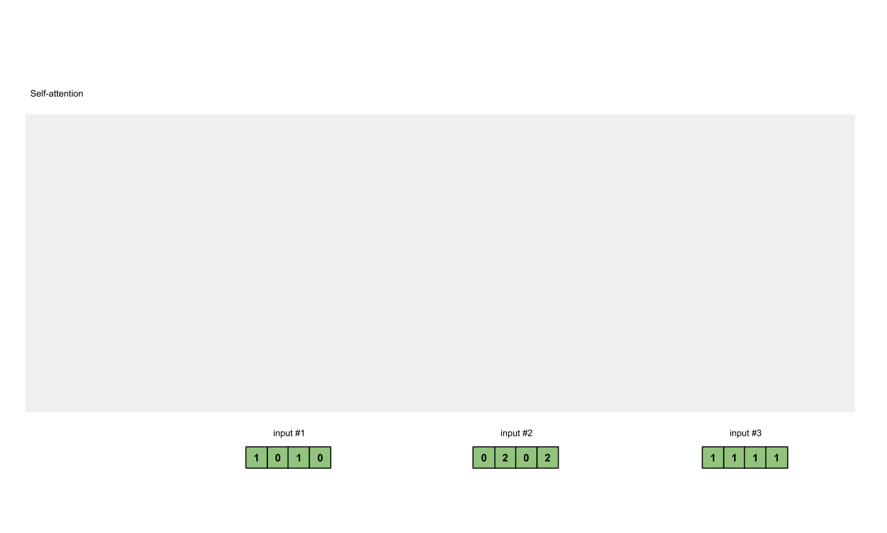

# 从头开始构建DETR网络

来自文章 ["End-to-End Object Detection with Transformers"](https://scontent-hkg4-1.xx.fbcdn.net/v/t39.2365-6/154305880_816694605586461_2873294970659239190_n.pdf?_nc_cat=108&ccb=1-7&_nc_sid=3c67a6&_nc_ohc=7kbGRIBAKBgAX-YDqBc&_nc_ht=scontent-hkg4-1.xx&oh=00_AfDTc8IvCPPdbB9EaI5dxC1D6BX6XYXmDruSfxcmlNGttQ&oe=6521EF03)

源码参考 [[github]facebookresearch/detr](https://github.com/facebookresearch/detr)

解析参考 [Bubbliiiing的CSDN](https://blog.csdn.net/weixin_44791964/article/details/128361674)

## 整体结构解析


上面这幅图是论文里的Fig. 2，比较好的展示了整个DETR的工作原理。原文中说DETR无需手工融入先验知识的结构（如NMS非极大值抑制、Anchor生成），实现端到端的目标检测，且检测结果是一次并行输出的。整个DETR可以分为四个部分，分别是：backbone、encoder、decoder以及prediction heads。

**backbone 是DETR的主干特征提取网络**，输入的图片首先会在主干网络里面进行特征提取，提取到的特征可以被称作特征层，是输入图片的特征集合。在主干部分，我们获取了一个特征层进行下一步网络的构建，这一个特征层我称它为有效特征层。

**encoder 是Transformer的编码网络-特征加强**，在主干部分获得的一个有效特征层会首先在高宽维度进行平铺 [CxHxW -> Cx(HxW)]，成为一个特征序列，然后会在这一部分继续使用Self-Attension进行加强特征提取，获得一个加强后的有效特征层。它属于Transformer的编码网络，编码的下一步是解码。

**decoder 是Transformer的解码网络-特征查询**，在encoder部分获得的一个加强后的有效特征层会在这一部分进行解码，解码需要使用到一个非常重要的可学习模块，即上图呈现的object queries。在decoder部分，我们使用一个可学习的查询向量q对加强后的有效特征层进行查询，获得预测结果。

**prediction heads 是DETR的分类器与回归器**，其实就是对decoder获得的预测结果进行全连接，两次全连接分别代表种类和回归参数。图上画了4个FFN，源码中是2个FFN。

因此，整个DETR网络所作的工作就是 **特征提取-特征加强-特征查询-预测结果**。

## models

首先由文中所述结构，构建模型

### backbone

DETR可以采用多种的主干特征提取网络，论文中用的是Resnet，本文以Resnet50网络为例子来给大家演示一下。

#### residual net

<div align=center>

</div>

残差网络，将靠前若干层的某一层数据输出直接跳过多层引入到后面数据层的输入部分。意味着后面的特征层的内容会有一部分由其前面的某一层线性贡献。

#### residual block

<div align=center>

</div>

ResNet的基础架构——残差块（residual block）。在残差块中，输入可通过跨层数据线路更快地向前传播。

#### ResNet50

ResNet50有两个基本的块，分别名为**Conv Block**和**Identity Block**，其中Conv Block输入和输出的维度是不一样的，所以不能连续串联，它的作用是改变网络的维度；Identity Block输入维度和输出维度相同，可以串联，它的作用是加深网络的。

Conv Block的结构如下，由图可以看出，Conv Block可以分为两个部分，左边部分为主干部分，存在两次卷积、标准化、激活函数和一次卷积、标准化；右边部分为残差边部分，存在一次卷积、标准化，由于残差边部分存在卷积，所以我们可以利用Conv Block改变输出特征层的宽高和通道数：

<div align=center>

</div>

Identity Block的结构如下，由图可以看出，Identity Block可以分为两个部分，左边部分为主干部分，存在两次卷积、标准化、激活函数和一次卷积、标准化；右边部分为残差边部分，直接与输出相接，由于残差边部分不存在卷积，所以Identity Block的输入特征层和输出特征层的shape是相同的，可用于加深网络：

<div align=center>

</div>

总的网络结构如下：

<div align=center>

</div>

#### 创建 BackboneBase 基类:

```python
'''
backbone：一个 PyTorch 模型，用作主干模型。
train_backbone：一个布尔值，指示是否训练主干模型的所有参数。
num_channels：一个整数，表示主干模型输出的特征图的通道数。
return_interm_layers：一个布尔值，指示是否返回主干模型的中间层输出。
'''
class BackboneBase(nn.Module):

    def __init__(self, backbone: nn.Module, train_backbone: bool, num_channels: int, return_interm_layers: bool):
        super().__init__()
        # 使用 backbone.named_parameters() 遍历主干模型的所有参数。如果 train_backbone 为 False，或者参数名称中不包含
        # 'layer2'、'layer3' 或 'layer4'，则将该参数的 requires_grad 设置为 False，即冻结对应的参数不参与训练。
        for name, parameter in backbone.named_parameters():
            if not train_backbone or 'layer2' not in name and 'layer3' not in name and 'layer4' not in name:
                parameter.requires_grad_(False)

        # 根据 return_interm_layers 的值，确定要返回的主干模型的哪些层的输出。如果 return_interm_layers 为 True，
        # 则返回所有层的输出，否则只返回最后一层（'layer4'）的输出。这些层的输出将通过 IntermediateLayerGetter 类进行提取。
        if return_interm_layers:
            return_layers = {"layer1": "0", "layer2": "1", "layer3": "2", "layer4": "3"}
        else:
            return_layers = {'layer4': "0"}
        
        # self.body 是一个 IntermediateLayerGetter 对象，它将主干模型 backbone 作为输入，并根据 return_layers 参数提取所需层的输出。
        self.body = IntermediateLayerGetter(backbone, return_layers=return_layers)
        self.num_channels = num_channels

    # 定义模型的前向传播过程。接受一个名为 tensor_list 的 NestedTensor 对象作为输入。
    def forward(self, tensor_list: NestedTensor):
        # 通过 self.body 对输入的 tensor_list.tensors（即输入张量）进行主干模型的前向计算，得到一系列的特征图输出，存储在字典 xs 中，键为层的名称。
        xs = self.body(tensor_list.tensors)
        out: Dict[str, NestedTensor] = {}

        # 遍历 xs 中的每个特征图输出，对应的输入掩码为 tensor_list.mask。通过插值操作将输入掩码与特征图输出的尺寸对齐，
        # 并将其转换为布尔类型。然后，将特征图输出和对应的掩码存储为 NestedTensor 对象，并将其添加到输出字典 out 中。
        for name, x in xs.items():
            m = tensor_list.mask
            assert m is not None
            mask = F.interpolate(m[None].float(), size=x.shape[-2:]).to(torch.bool)[0]
            out[name] = NestedTensor(x, mask)
        return out
```

**nn.Module 的 named_parameters 方法**

`nn.Module` 的 `named_parameters`方法，用于返回模型中所有可学习参数的迭代器。它返回一个迭代器，每次迭代产生一个元组，包含参数的名称和参数本身。

例如，假设有一个名为 `model` 的模型对象，可以使用 `model.named_parameters()` 来获取模型中所有参数的迭代器，然后对其进行遍历：

```python
for name, parameter in model.named_parameters():
    print(name, parameter.shape)
```

在上面的示例中，`name` 是参数的名称，`parameter` 是参数本身。可以根据需要对参数进行操作，例如打印参数的形状、设置参数的 `requires_grad` 等。

`named_parameters` 方法返回的参数名称不一定按照 "layer1"、"layer2" 的规范命名。实际上，参数的名称是根据模型的结构和定义方式来确定的。

在 PyTorch 中，模型的结构通常是由多个层组成，每个层都可以包含多个参数。参数的名称通常是根据层的名称和参数的作用来命名的，但并不限于 "layer1"、"layer2" 的格式。

例如，对于一个名为 `model` 的模型，它可能具有以下参数名称：

- `conv1.weight`
- `conv1.bias`
- `fc.weight`
- `fc.bias`

上述示例中，`conv1` 和 `fc` 是模型中的层的名称，`weight` 和 `bias` 是层中的参数名称。这些名称是在模型定义的过程中指定的。

**IntermediateLayerGetter对象**

`IntermediateLayerGetter` 是 PyTorch 中的一个类，用于从模型中提取中间层的输出。它接受一个模型对象和一个字典作为参数，并返回一个新的模型对象，该对象可以用于获取指定中间层的输出。

构造 `IntermediateLayerGetter` 对象时，需要传入两个参数：

1. `model`：要提取中间层输出的模型对象。
2. `return_layers`：一个字典，指定要返回的中间层的名称和对应的模型层。

字典 `return_layers` 的格式是 `{name: layer}`，其中 `name` 是中间层的名称，`layer` 是对应的模型层。中间层的名称可以是任何字符串，用于标识该层的输出。模型层可以是模型中的任何层，例如 `nn.Conv2d`、`nn.Linear` 等。

以下是使用 `IntermediateLayerGetter` 的一个示例：

```python
import torch
import torch.nn as nn

class MyModel(nn.Module):
    def __init__(self):
        super(MyModel, self).__init__()
        self.conv1 = nn.Conv2d(3, 64, kernel_size=3)
        self.relu = nn.ReLU()
        self.conv2 = nn.Conv2d(64, 128, kernel_size=3)
        
    def forward(self, x):
        out1 = self.conv1(x)
        out2 = self.relu(out1)
        out3 = self.conv2(out2)
        return out1, out3

model = MyModel()
return_layers = {'conv1_output': 'conv1', 'conv2_output': 'conv2'}
intermediate_model = IntermediateLayerGetter(model, return_layers)
```

在上述示例中，我们定义了一个名为 `MyModel` 的模型，其中包含两个卷积层 `conv1` 和 `conv2`。我们希望获取 `conv1` 层和 `conv2` 层的输出。我们构造了一个字典 `return_layers`，指定了中间层的名称和对应的模型层。然后，我们使用 `IntermediateLayerGetter` 构造了一个新的模型对象 `intermediate_model`，该对象可以用于获取指定中间层的输出。

使用 `intermediate_model` 对象时，可以按照正常的方式进行前向传播，然后通过指定中间层的名称来获取对应层的输出。例如：

```python
x = torch.randn(1, 3, 32, 32)
out1, out2 = intermediate_model(x)
```

在上述示例中，`out1` 和 `out2` 分别是 `conv1` 层和 `conv2` 层的输出。

**NestedTensor 对象及掩码**

`NestedTensor` 是一个 DETR 中的一个自定义数据结构，用于处理嵌套形状的张量。它通过将张量和其对应的形状信息封装在一起，提供了一种处理具有不规则形状的数据的方式。

在 `NestedTensor` 中，张量可以具有不同的形状，而不仅仅是标准的形状。例如，可以处理由不同大小的图像组成的批次数据或具有不同数量的对象的图像。

`NestedTensor` 对象由两部分组成：

1. `tensor`：一个包含实际数据的张量。它可以是一个标准的 PyTorch 张量或另一个 `NestedTensor` 对象。
2. `mask`：一个与 `tensor` 相同形状的二进制掩码，用于指示哪些元素是有效的，哪些是填充或无效的。

掩码是一个二进制张量，与 `tensor` 具有相同的形状，其中有效元素的位置被设置为 1，填充或无效元素的位置被设置为 0。掩码的作用是在处理嵌套形状的张量时，提供对不同形状元素的处理和对齐的能力。

使用 `NestedTensor` 对象时，可以像使用标准张量一样进行操作，例如进行前向传播、计算损失等。同时，掩码可以用于在需要时对填充或无效元素进行处理，以确保正确的计算。

在`util/misc.py`中定义`NestedTensor`:

```python
class NestedTensor(object):
    def __init__(self, tensors, mask: Optional[Tensor]):
        self.tensors = tensors
        self.mask = mask

    def to(self, device):
        # type: (Device) -> NestedTensor # noqa
        cast_tensor = self.tensors.to(device)
        mask = self.mask
        if mask is not None:
            assert mask is not None
            cast_mask = mask.to(device)
        else:
            cast_mask = None
        return NestedTensor(cast_tensor, cast_mask)

    def decompose(self):
        return self.tensors, self.mask

    def __repr__(self):
        return str(self.tensors)
```

创建掩码时，我们使用与输入张量相同形状的掩码张量。由于掩码的作用是指示哪些元素是有效的，哪些是填充或无效的，因此我们只需要关注有效元素的位置，即前两个维度的大小，通常表示样本数和通道数。

在 `BackboneBase` 代码段中，使用插值操作生成了一个与输入张量 `x` 相同形状的掩码 `mask`。代码中使用了 `F.interpolate()` 函数进行插值操作。该函数可以根据指定的大小对输入进行插值，以生成与目标大小匹配的输出。

在这里，`m[None]` 将掩码 `m` 添加了一个额外的维度，以匹配输入张量 `x` 的维度。这是因为 `F.interpolate()` 函数期望输入是一个四维张量，而 `m` 是一个三维的掩码张量。

接下来，`.float()` 将掩码张量转换为浮点类型，因为 `F.interpolate()` 函数要求输入为浮点类型。

然后，通过指定 `size=x.shape[-2:]`，将目标大小设置为与输出张量 `x` 的最后两个维度相同的大小。这样可以确保生成的掩码与输出张量具有相同的高度和宽度。

最后，`.to(torch.bool)` 将插值得到的浮点数掩码转换为布尔类型，以匹配原始掩码的数据类型。

#### 创建 Backbone

```python
'''
name：一个字符串，指定所使用的 torchvision.models 中的模型类型（例如，'resnet18'、'resnet34'等）。
train_backbone：一个布尔值，指定是否训练整个骨干网络。
return_interm_layers：一个布尔值，指定是否返回骨干网络中间层的输出。
dilation：一个布尔值，指定是否在骨干网络中使用空洞卷积（dilated convolution）。
'''
class Backbone(BackboneBase):
    """ResNet backbone with frozen BatchNorm."""
    def __init__(self, name: str,
                 train_backbone: bool,
                 return_interm_layers: bool,
                 dilation: bool):

        # 在创建 ResNet 模型实例时，通过 replace_stride_with_dilation 参数指定是否将步幅替换为空洞卷积的扩张率。
        # 这个参数是一个布尔值的列表，用于指定每个阶段（stage）是否使用空洞卷积。
        # 第一个和第二个阶段的步幅不被替换，而第三个阶段根据 dilation 参数来决定是否替换。
        backbone = getattr(torchvision.models, name)(
            replace_stride_with_dilation=[False, False, dilation],
            pretrained=is_main_process(), norm_layer=FrozenBatchNorm2d)
        # 通过 is_main_process() 函数判断当前是否是主进程，并将结果作为 pretrained 参数传递给 ResNet 模型。
        # 这个参数指定是否加载预训练的权重。

        num_channels = 512 if name in ('resnet18', 'resnet34') else 2048
        super().__init__(backbone, train_backbone, num_channels, return_interm_layers)
```

`TODO:` backbone = getattr(torchvision.models, name) 换成自实现的网络

**判断是否处于主进程 is_main_process**

在分布式训练中只有一个进程加载预训练权重并共享给其他进程使用。

```python
# 检查分布式训练环境是否可用和已初始化
def is_dist_avail_and_initialized():
    if not dist.is_available():
        return False
    if not dist.is_initialized():
        return False
    return True

# 获取当前进程的分布式训练排名（rank）
def get_rank():
    if not is_dist_avail_and_initialized():
        return 0
    return dist.get_rank()

# 判断当前进程是否为主进程
def is_main_process():
    return get_rank() == 0
```

**冻结批归一化 FrozenBatchNorm2d**

在训练过程中，批归一化层会根据当前批量数据的均值和方差来规范化输入，同时维护每个通道的移动平均均值和方差。然而，在某些情况下，我们可能希望在模型的推理阶段（测试或推断）中固定批归一化层的统计信息，以避免对输入数据进行重新计算。

`FrozenBatchNorm2d` 类就是为了解决这个问题而设计的。它是 `torch.nn` 模块中的一个子类，用于实现冻结批归一化。与普通的批归一化层不同，`FrozenBatchNorm2d` 在推理阶段不会更新统计信息，而是使用训练阶段计算得到的固定值进行归一化。

使用 `FrozenBatchNorm2d` 有助于保持模型在推理阶段的一致性，并提高模型的可重复性。它常用于在训练过程中使用批归一化层，而在推理过程中使用冻结的批归一化层。

```python
class FrozenBatchNorm2d(torch.nn.Module):
    """
    BatchNorm2d where the batch statistics and the affine parameters are fixed.

    Copy-paste from torchvision.misc.ops with added eps before rqsrt,
    without which any other models than torchvision.models.resnet[18,34,50,101]
    produce nans.
    """
    def __init__(self, n):
        super(FrozenBatchNorm2d, self).__init__()
        self.register_buffer("weight", torch.ones(n))
        self.register_buffer("bias", torch.zeros(n))
        self.register_buffer("running_mean", torch.zeros(n))
        self.register_buffer("running_var", torch.ones(n))

    def _load_from_state_dict(self, state_dict, prefix, local_metadata, strict,
                              missing_keys, unexpected_keys, error_msgs):
        num_batches_tracked_key = prefix + 'num_batches_tracked'
        if num_batches_tracked_key in state_dict:
            del state_dict[num_batches_tracked_key]

        super(FrozenBatchNorm2d, self)._load_from_state_dict(
            state_dict, prefix, local_metadata, strict,
            missing_keys, unexpected_keys, error_msgs)

    def forward(self, x):
        # move reshapes to the beginning
        # to make it fuser-friendly
        w = self.weight.reshape(1, -1, 1, 1)
        b = self.bias.reshape(1, -1, 1, 1)
        rv = self.running_var.reshape(1, -1, 1, 1)
        rm = self.running_mean.reshape(1, -1, 1, 1)
        eps = 1e-5
        scale = w * (rv + eps).rsqrt()
        bias = b - rm * scale
        return x * scale + bias
```

归一化过程：

$$
x \cdot scale + bias = x \cdot scale + b -rm \cdot scale = (x - rm) \cdot scale + b = (x - rm) \cdot w\sqrt{\frac{1}{rv + eps}} + b = w \sqrt{\frac{(x - rm)^2}{rv + eps}} + b
$$

#### Position Encoding

其实就是原Transformer的position embedding的思想，为所有特征添加上位置信息，这样网络才有区分不同区域的能力。

DETR是为resnet输出的特征图在pos_x和pos_y方向各自计算了一个位置编码，每个维度的位置编码长度为num_pos_feats，默认为Transformer的特征长度的一半，为128。对pos_x和pos_y，在奇数位置计算正弦，在偶数位置计算余弦，然后将计算结果进行拼接。得到一个[batch_size, h, w, 256]的向量。最后进行转置，获得[batch_size, 256, h, w]的向量。

**如何编码位置**

$$e^{i\theta} = cos(\theta) + i \cdot sin(\theta)$$

`(cos,sin)`即可指示 $\theta$ 的位置，要给图像矩阵的每个位置编码指示其位置信息的向量：

1. 将其缩放到0-2pi范围内
2. $sin(\frac{2\pi}{T} \cdot x)$ 由T指示正余弦函数的频率

```python
'''
num_pos_feats：位置特征的数量，默认为64。它确定了生成的位置编码的维度。
temperature：温度参数，默认为10000。它用于缩放位置编码中的频率。
normalize：一个布尔值，指示是否对位置编码进行归一化。默认为False。
scale：位置编码的缩放因子，默认为None。如果scale为None且normalize为False，则scale被设置为2pi。
'''
class PositionEmbeddingSine(nn.Module):
    """
    This is a more standard version of the position embedding, very similar to the one
    used by the Attention is all you need paper, generalized to work on images.
    """
    def __init__(self, num_pos_feats=64, temperature=10000, normalize=False, scale=None):
        super().__init__()
        self.num_pos_feats = num_pos_feats
        self.temperature = temperature
        self.normalize = normalize
        if scale is not None and normalize is False:
            raise ValueError("normalize should be True if scale is passed")
        if scale is None:
            scale = 2 * math.pi
        self.scale = scale

    # 接受一个`NestedTensor`作为输入，并返回位置编码。`NestedTensor`是一个包含了图像张量和对应掩码的数据结构。
    def forward(self, tensor_list: NestedTensor):
        x = tensor_list.tensors
        mask = tensor_list.mask
        assert mask is not None
        not_mask = ~mask
        # cumsum计算掩码为0的元素的累积和（每个元素都带有之前的累加值），得到`y_embed`和`x_embed`。
        # 这一步可以理解为为0掩码的位置分配一个连续的整数值，以表示它们在序列中的位置。
        y_embed = not_mask.cumsum(1, dtype=torch.float32)
        x_embed = not_mask.cumsum(2, dtype=torch.float32)
        
        # 如果`normalize`为True，则对`y_embed`和`x_embed`进行归一化处理。
        # 将每个位置的累积和除以该维度的最大累积和，并乘以`scale`，以确保位置编码的数值范围在0到`scale`之间。
        if self.normalize:
            eps = 1e-6
            y_embed = y_embed / (y_embed[:, -1:, :] + eps) * self.scale
            x_embed = x_embed / (x_embed[:, :, -1:] + eps) * self.scale

        # 创建一个维度变换参数dim_t，用于计算正弦和余弦函数的频率。dim_t的形状为(num_pos_feats,)，其中每个元素根据其索引计算得到
        dim_t = torch.arange(self.num_pos_feats, dtype=torch.float32, device=x.device)
        dim_t = self.temperature ** (2 * (dim_t // 2) / self.num_pos_feats)

        # 将`pos_x`和`pos_y`计算为位置编码的正弦和余弦部分。这里使用了三角函数的性质，将位置编码表示为正弦和余弦函数的组合。
        # 具体来说，将`pos_x`和`pos_y`的形状变换为`(batch_size, num_pos_feats//2, height, width, 2)`，
        # 其中最后一个维度的第一个通道存储正弦部分，第二个通道存储余弦部分。
        pos_x = x_embed[:, :, :, None] / dim_t
        pos_y = y_embed[:, :, :, None] / dim_t
        pos_x = torch.stack((pos_x[:, :, :, 0::2].sin(), pos_x[:, :, :, 1::2].cos()), dim=4).flatten(3)
        pos_y = torch.stack((pos_y[:, :, :, 0::2].sin(), pos_y[:, :, :, 1::2].cos()), dim=4).flatten(3)
        # 将`pos_x`和`pos_y`展平并连接在一起，得到形状为`(batch_size, num_pos_feats, height, width)`的位置编码。
        pos = torch.cat((pos_y, pos_x), dim=3).permute(0, 3, 1, 2)
        return pos
```

**cumsum累积和**说明：

- sum函数将所有元素相加，得到总和。在示例中，x.sum()的结果是15。

- cumsum函数则计算累积和，它会返回一个与输入张量形状相同的张量，其中每个位置的值等于该位置及之前位置的元素之和。在示例中，x.cumsum(dim=0)的结果是tensor([1, 3, 6, 10, 15])。可以看到，结果张量中的每个元素都是原始张量中对应位置及之前位置的元素之和。

```python
import torch

# 示例张量
x = torch.tensor([1, 2, 3, 4, 5])

# 使用sum函数对张量进行求和
sum_result = x.sum()
print("Sum Result:", sum_result.item())
# 输出: Sum Result: 15

# 使用cumsum函数对张量进行累积和计算
cumsum_result = x.cumsum(dim=0)
print("Cumulative Sum Result:", cumsum_result)
# 输出: Cumulative Sum Result: tensor([ 1,  3,  6, 10, 15])
```

#### 结合特征与位置编码

将backbone输出的特征图与位置编码组合为输入Transformer模型做准备

```python
class Joiner(nn.Sequential):
    def __init__(self, backbone, position_embedding):
        super().__init__(backbone, position_embedding)

    def forward(self, tensor_list: NestedTensor):
        xs = self[0](tensor_list)
        out: List[NestedTensor] = []
        pos = []
        for name, x in xs.items():
            out.append(x)
            # position encoding
            pos.append(self[1](x).to(x.tensors.dtype))

        return out, pos
```

### Transformer

<div align=center>

</div>


#### Transformer Encoder

在上文中，我们获得了两个矩阵，一个矩阵是输入图片的特征矩阵，一个是特征矩阵对应的位置编码。它们的shape分别为[batch_size, 2048, 25, 25]、[batch_size, 256, 25, 25]。

在编码网络部分，DETR使用Transformer的Encoder部分进行特征提取。我们需要首先对特征矩阵进行通道的缩放，如果直接对特征矩阵进行transformer的特征提取的话，由于网络的通道数太大（2048），会直接导致显存不足。**利用一个[256x2048x1x1]的nn.Conv2d点卷积**进行通道的压缩，压缩后的通道为256，即Transformer用到的特征长度。此时我们获得了一个shape为[batch_size, 256, 25, 25]的特征矩阵。

然后我们对特征矩阵与位置编码的高宽维度进行平铺获得两个shape为[batch_size, 256, 625]的矩阵，由于我们使用的是**Pytorch自带的nn.MultiheadAttention**，该模块要求batch_size位于第1维，序列长度位于第0维，所以我们将特征矩阵与位置编码进行转置，转置后的两个矩阵为[625, batch_size, 256]。

我们此时可以将其输入到Encoder当中进行特征提取。Encoder并不会改变输入的shape，因此经过Encoder进行特征提取的加强后的特征序列shape也为[625, batch_size, 256]。

```python
class TransformerEncoder(nn.Module):
    '''
    encoder_layer: TransformerEncoderLayer类型的编码器层
    num_layers: 编码器层数 n
    norm: 归一化操作
    '''
    def __init__(self, encoder_layer, num_layers, norm=None):
        super().__init__()
        self.layers = _get_clones(encoder_layer, num_layers)
        self.num_layers = num_layers
        self.norm = norm

    def forward(self, src,
                mask: Optional[Tensor] = None,
                src_key_padding_mask: Optional[Tensor] = None,
                pos: Optional[Tensor] = None):
        output = src

        for layer in self.layers:
            output = layer(output, src_mask=mask,
                           src_key_padding_mask=src_key_padding_mask, pos=pos)

        if self.norm is not None:
            output = self.norm(output)

        return output

def _get_clones(module, N):
    return nn.ModuleList([copy.deepcopy(module) for i in range(N)])

def _get_activation_fn(activation):
    """Return an activation function given a string"""
    if activation == "relu":
        return F.relu
    if activation == "gelu":
        return F.gelu
    if activation == "glu":
        return F.glu
    raise RuntimeError(F"activation should be relu/gelu, not {activation}.")

class TransformerEncoderLayer(nn.Module):
    '''
    d_model: 输入特征的维度
    nhead: 多头注意力的头数
    dim_feedforward: 前馈神经网络隐藏层的维度
    dropout: dropout操作的概率
    activation: 前馈神经网络的激活函数类型
    normalize_before: 归一化操作是否在前
    '''
    def __init__(self, d_model, nhead, dim_feedforward=2048, dropout=0.1,
                 activation="relu", normalize_before=False):
        super().__init__()

        # 多头自注意力层
        self.self_attn = nn.MultiheadAttention(d_model, nhead, dropout=dropout)
        # 前馈神经网络层
        self.linear1 = nn.Linear(d_model, dim_feedforward)
        self.dropout = nn.Dropout(dropout)
        self.linear2 = nn.Linear(dim_feedforward, d_model)
        # 层归一化层
        self.norm1 = nn.LayerNorm(d_model)
        self.norm2 = nn.LayerNorm(d_model)
        # Dropout层
        self.dropout1 = nn.Dropout(dropout)
        self.dropout2 = nn.Dropout(dropout)
        # 激活函数
        self.activation = _get_activation_fn(activation)
        # 归一化操作前后
        self.normalize_before = normalize_before

    def with_pos_embed(self, tensor, pos: Optional[Tensor]):
        return tensor if pos is None else tensor + pos

    def forward_post(self,
                     src,
                     src_mask: Optional[Tensor] = None,
                     src_key_padding_mask: Optional[Tensor] = None,
                     pos: Optional[Tensor] = None):
        # 查询和键直接使用 输入嵌入+位置嵌入
        q = k = self.with_pos_embed(src, pos)
        # 多头自注意力，值 使用源输入
        # self.self_attn调用它时会返回一个元组，其中包含了注意力计算的结果和注意力权重
        src2 = self.self_attn(q, k, value=src, attn_mask=src_mask,
                              key_padding_mask=src_key_padding_mask)[0]
        # 残差连接
        src = src + self.dropout1(src2)
        # 层归一化
        src = self.norm1(src)

        # 全连接前馈网络
        # 625, batch_size, 256 => 625, batch_size, 2048 => 625, batch_size, 256
        src2 = self.linear2(self.dropout(self.activation(self.linear1(src))))
        # 残差连接
        src = src + self.dropout2(src2)
        # 层归一化
        src = self.norm2(src)
        return src

    def forward_pre(self, src,
                    src_mask: Optional[Tensor] = None,
                    src_key_padding_mask: Optional[Tensor] = None,
                    pos: Optional[Tensor] = None):
        # 归一化在前
        src2 = self.norm1(src)
        q = k = self.with_pos_embed(src2, pos)
        src2 = self.self_attn(q, k, value=src2, attn_mask=src_mask,
                              key_padding_mask=src_key_padding_mask)[0]
        src = src + self.dropout1(src2)
        src2 = self.norm2(src)
        src2 = self.linear2(self.dropout(self.activation(self.linear1(src2))))
        src = src + self.dropout2(src2)
        return src

    def forward(self, src,
                src_mask: Optional[Tensor] = None,
                src_key_padding_mask: Optional[Tensor] = None,
                pos: Optional[Tensor] = None):
        if self.normalize_before:
            return self.forward_pre(src, src_mask, src_key_padding_mask, pos)
        return self.forward_post(src, src_mask, src_key_padding_mask, pos)
```

**MultiheadAttention 多头自注意力**

一个序列产生三个单位输入，每一个序列单位的输入都可以通过三个处理（比如全连接）获得Query、Key、Value。Query是查询向量、Key是键向量、Value值向量。

<div align=center>

</div>

1. 利用input-1的查询向量，分别乘上input-1、input-2、input-3的键向量，此时我们获得了三个score。
2. 然后对这三个score取softmax，获得了input-1、input-2、input-3各自的重要程度。
3. 然后将这个重要程度乘上input-1、input-2、input-3的值向量，求和。
4. 此时我们获得了input-1的输出。

在使用自注意力计算相关性的时候，就是用 q 去找相关的k。但是相关有很多种不同的形式，所以也许可以有多个 q，不同的 q 负责不同种类的相关
性，这就是多头注意力。

<div align=center>

</div>

#### Transformer Decoder

通过上述编码步骤，我们可以获得一个利用Encoder加强特征提取后的特征矩阵，它的shape为[625, batch_size, 256]。

在encoder部分获得的一个加强后的有效特征层会在这一部分进行解码，解码需要使用到一个非常重要的可学习模块，即上图呈现的object queries。在decoder部分，我们使用一个可学习的查询向量q对加强后的有效特征层进行查询，获得预测结果。

在实际构建时，我们首先利用nn.Embedding(num_queries, hidden_dim)创建一个Embedding类别，然后利用.weight获取这个Embedding的权重作为可学习的查询向量query_embed。默认的num_queries值为100，hidden_dim值为256。因此查询向量query_embed本质上是一个[100, 256]的矩阵。加上batch维度后变成[100, batch_size, 256]。

另外，我们还通过tgt = torch.zeros_like(query_embed)创建了一个与查询向量一样shape的矩阵，作为输入。

参考右边Transformer Decoder的结构，tgt作为Output Embedding输入到Decoder中，query_embed作为Positional Encoding输入到Decoder中。

首先自我进行一个Self-Attention的结构，输入是[100, batch_size, 256]，输出也是[100, batch_size, 256]。
然后再次利用另一个Self-Attention，将刚刚获得的[100, batch_size, 256]输出作为Self-Attention的q，Encoder加强特征提取后的特征矩阵作为Self-Attention的k、v，进行特征提取。这个过程可以理解为使用查询向量对Self-Attention的k、v进行查询。由于查询向量q的序列长度为100，无论k、v的序列长度为多少，最终输出的序列长度都为100。

因此对于解码网络Decoder而言，输出的序列shape为[100, batch_size, 256]。

```python
class TransformerDecoder(nn.Module):

    def __init__(self, decoder_layer, num_layers, norm=None, return_intermediate=False):
        super().__init__()
        self.layers = _get_clones(decoder_layer, num_layers)
        self.num_layers = num_layers
        self.norm = norm
        self.return_intermediate = return_intermediate

    def forward(self, tgt, memory,
                tgt_mask: Optional[Tensor] = None,
                memory_mask: Optional[Tensor] = None,
                tgt_key_padding_mask: Optional[Tensor] = None,
                memory_key_padding_mask: Optional[Tensor] = None,
                pos: Optional[Tensor] = None,
                query_pos: Optional[Tensor] = None):
        output = tgt

        intermediate = []

        for layer in self.layers:
            output = layer(output, memory, tgt_mask=tgt_mask,
                           memory_mask=memory_mask,
                           tgt_key_padding_mask=tgt_key_padding_mask,
                           memory_key_padding_mask=memory_key_padding_mask,
                           pos=pos, query_pos=query_pos)
            if self.return_intermediate:
                intermediate.append(self.norm(output))

        if self.norm is not None:
            output = self.norm(output)
            if self.return_intermediate:
                intermediate.pop()
                intermediate.append(output)

        if self.return_intermediate:
            return torch.stack(intermediate)

        return output.unsqueeze(0)

class TransformerDecoderLayer(nn.Module):

    def __init__(self, d_model, nhead, dim_feedforward=2048, dropout=0.1,
                 activation="relu", normalize_before=False):
        super().__init__()
        self.self_attn = nn.MultiheadAttention(d_model, nhead, dropout=dropout)
        self.multihead_attn = nn.MultiheadAttention(d_model, nhead, dropout=dropout)
        # Implementation of Feedforward model
        self.linear1 = nn.Linear(d_model, dim_feedforward)
        self.dropout = nn.Dropout(dropout)
        self.linear2 = nn.Linear(dim_feedforward, d_model)

        self.norm1 = nn.LayerNorm(d_model)
        self.norm2 = nn.LayerNorm(d_model)
        self.norm3 = nn.LayerNorm(d_model)
        self.dropout1 = nn.Dropout(dropout)
        self.dropout2 = nn.Dropout(dropout)
        self.dropout3 = nn.Dropout(dropout)

        self.activation = _get_activation_fn(activation)
        self.normalize_before = normalize_before

    def with_pos_embed(self, tensor, pos: Optional[Tensor]):
        return tensor if pos is None else tensor + pos

    def forward_post(self, tgt, memory,
                     tgt_mask: Optional[Tensor] = None,
                     memory_mask: Optional[Tensor] = None,
                     tgt_key_padding_mask: Optional[Tensor] = None,
                     memory_key_padding_mask: Optional[Tensor] = None,
                     pos: Optional[Tensor] = None,
                     query_pos: Optional[Tensor] = None):
        # 首先一次自注意力，查询和键均取 输出嵌入+可学习的查询向量 query_pos=query_embed
        # 100, batch_size, 256 => 100, batch_size, 256
        q = k = self.with_pos_embed(tgt, query_pos)
        tgt2 = self.self_attn(q, k, value=tgt, attn_mask=tgt_mask,
                              key_padding_mask=tgt_key_padding_mask)[0]
        # 残差连接与层归一化
        tgt = tgt + self.dropout1(tgt2)
        tgt = self.norm1(tgt)

        # 自注意力，掩码
        tgt2 = self.multihead_attn(query=self.with_pos_embed(tgt, query_pos),
                                   key=self.with_pos_embed(memory, pos),
                                   value=memory, attn_mask=memory_mask,
                                   key_padding_mask=memory_key_padding_mask)[0]
        
        # 残差连接与层归一化
        tgt = tgt + self.dropout2(tgt2)
        tgt = self.norm2(tgt)
        # 全连接前馈网络
        tgt2 = self.linear2(self.dropout(self.activation(self.linear1(tgt))))
        tgt = tgt + self.dropout3(tgt2)
        tgt = self.norm3(tgt)
        return tgt

    def forward_pre(self, tgt, memory,
                    tgt_mask: Optional[Tensor] = None,
                    memory_mask: Optional[Tensor] = None,
                    tgt_key_padding_mask: Optional[Tensor] = None,
                    memory_key_padding_mask: Optional[Tensor] = None,
                    pos: Optional[Tensor] = None,
                    query_pos: Optional[Tensor] = None):
        tgt2 = self.norm1(tgt)
        q = k = self.with_pos_embed(tgt2, query_pos)
        tgt2 = self.self_attn(q, k, value=tgt2, attn_mask=tgt_mask,
                              key_padding_mask=tgt_key_padding_mask)[0]
        tgt = tgt + self.dropout1(tgt2)
        tgt2 = self.norm2(tgt)
        tgt2 = self.multihead_attn(query=self.with_pos_embed(tgt2, query_pos),
                                   key=self.with_pos_embed(memory, pos),
                                   value=memory, attn_mask=memory_mask,
                                   key_padding_mask=memory_key_padding_mask)[0]
        tgt = tgt + self.dropout2(tgt2)
        tgt2 = self.norm3(tgt)
        tgt2 = self.linear2(self.dropout(self.activation(self.linear1(tgt2))))
        tgt = tgt + self.dropout3(tgt2)
        return tgt

    def forward(self, tgt, memory,
                tgt_mask: Optional[Tensor] = None,
                memory_mask: Optional[Tensor] = None,
                tgt_key_padding_mask: Optional[Tensor] = None,
                memory_key_padding_mask: Optional[Tensor] = None,
                pos: Optional[Tensor] = None,
                query_pos: Optional[Tensor] = None):
        if self.normalize_before:
            return self.forward_pre(tgt, memory, tgt_mask, memory_mask,
                                    tgt_key_padding_mask, memory_key_padding_mask, pos, query_pos)
        return self.forward_post(tgt, memory, tgt_mask, memory_mask,
                                 tgt_key_padding_mask, memory_key_padding_mask, pos, query_pos)
```

至此，我们可以构建完整的Transformer结构

```python
class Transformer(nn.Module):

    def __init__(self, d_model=512, nhead=8, num_encoder_layers=6,
                 num_decoder_layers=6, dim_feedforward=2048, dropout=0.1,
                 activation="relu", normalize_before=False,
                 return_intermediate_dec=False):
        super().__init__()

        encoder_layer = TransformerEncoderLayer(d_model, nhead, dim_feedforward,
                                                dropout, activation, normalize_before)
        encoder_norm = nn.LayerNorm(d_model) if normalize_before else None
        self.encoder = TransformerEncoder(encoder_layer, num_encoder_layers, encoder_norm)

        decoder_layer = TransformerDecoderLayer(d_model, nhead, dim_feedforward,
                                                dropout, activation, normalize_before)
        decoder_norm = nn.LayerNorm(d_model)
        self.decoder = TransformerDecoder(decoder_layer, num_decoder_layers, decoder_norm,
                                          return_intermediate=return_intermediate_dec)

        self._reset_parameters()

        self.d_model = d_model
        self.nhead = nhead

    def _reset_parameters(self):
        for p in self.parameters():
            if p.dim() > 1:
                nn.init.xavier_uniform_(p)

    def forward(self, src, mask, query_embed, pos_embed):
        '''
        query、key和value的维度为 (sequence_length, batch_size, embedding_dim)
        sequence_length 表示序列的长度，即输入序列的时间/空间步数。
        batch_size 表示批次大小，即同时处理的样本数量。
        embedding_dim 表示每个时间/空间步的嵌入维度或特征维度。
        attn_mask 和 key_padding_mask 的维度为 (batch_size, sequence_length) 或 (batch_size, 1, sequence_length)。
        attn_mask 用于在注意力计算中屏蔽无效的位置，而 key_padding_mask 用于屏蔽键序列中的填充位置。
        '''
        # flatten NxCxHxW to HWxNxC
        bs, c, h, w = src.shape
        src = src.flatten(2).permute(2, 0, 1)
        pos_embed = pos_embed.flatten(2).permute(2, 0, 1)
        query_embed = query_embed.unsqueeze(1).repeat(1, bs, 1)
        mask = mask.flatten(1)
        # mask = mask.unsqueeze(1)

        tgt = torch.zeros_like(query_embed)
        memory = self.encoder(src, src_key_padding_mask=mask, pos=pos_embed)
        hs = self.decoder(tgt, memory, memory_key_padding_mask=mask,
                          pos=pos_embed, query_pos=query_embed)
        return hs.transpose(1, 2), memory.permute(1, 2, 0).view(bs, c, h, w)
```

**nn.Embedding**


### Prediction Head

解码网络Decoder的输出为[100, batch_size, 256]，在实际使用时，为了方便，我们再次把batch_size放回第0维度，得到的矩阵为：[batch_size, 100, 256]

prediction heads是DETR的分类器与回归器，其实就是对decoder获得的预测结果进行全连接，两次全连接分别代表种类和回归参数。图上画了4个FFN，源码中是2个FFN。

其中输出分类信息的头，它最终的全连接神经元个数为num_classes + 1，num_classes代表要区分的类别数量，+1代表背景类。

- 如果使用的是voc训练集，类则为20种，最后的维度应该为21。

- 如果使用的是coco训练集，类则为80种，不过中间有一些为空的种类，空种类有11个，最后的维度应该为80+11+1=92。

因此分类信息头的输出shape为[batch_size, 100, num_classes + 1]

其中输出回归信息的头，它最终的全连接神经元个数为4。输出时会取一个sigmoid。前两个系数代表中心点坐标，后两个系数代表预测框宽高。因此分类信息头的输出shape为[batch_size, 100, 4]

具体实现如下：

```python
class MLP(nn.Module):
    """ Very simple multi-layer perceptron (also called FFN)多层感知器"""

    def __init__(self, input_dim, hidden_dim, output_dim, num_layers):
        super().__init__()
        self.num_layers = num_layers
        # 将隐藏层维度扩展成 (num_layers - 1) 长的列表
        h = [hidden_dim] * (num_layers - 1)
        # 将输入维度[input_dim] 与 h 拼接，即表示前一层的输入维度的列表
        self.layers = nn.ModuleList(nn.Linear(n, k) for n, k in zip([input_dim] + h, h + [output_dim]))

    def forward(self, x):
        for i, layer in enumerate(self.layers):
            x = F.relu(layer(x)) if i < self.num_layers - 1 else layer(x)
        return x
```

至此DETR模型的所有模块已经准备完成，可以搭建DETR了：

```python
class DETR(nn.Module):
    """ This is the DETR module that performs object detection """
    def __init__(self, backbone, transformer, num_classes, num_queries, aux_loss=False):
        """ Initializes the model.
        Parameters:
            backbone: torch module of the backbone to be used. See backbone.py
            transformer: torch module of the transformer architecture. See transformer.py
            num_classes: number of object classes
            num_queries: number of object queries, ie detection slot. This is the maximal number of objects
                         DETR can detect in a single image. For COCO, we recommend 100 queries.
            aux_loss: True if auxiliary decoding losses (loss at each decoder layer) are to be used.
        """
        super().__init__()
        # 每个注意力头的查询数量，与注意力头的个数区分
        self.num_queries = num_queries
        self.transformer = transformer
        # Transformer的输入维度
        hidden_dim = transformer.d_model
        # 输出分类信息
        self.class_embed = nn.Linear(hidden_dim, num_classes + 1)
        # 输出回归信息
        self.bbox_embed = MLP(hidden_dim, hidden_dim, 4, 3)
        # 传入Transformer进行查询的查询向量
        self.query_embed = nn.Embedding(num_queries, hidden_dim)
        # 传入Transformer的特征输入，需要与位置编码的特征通道相匹配
        self.input_proj = nn.Conv2d(backbone.num_channels, hidden_dim, kernel_size=1)
        # 主干网络
        self.backbone = backbone
        # 是否使用辅助分支
        self.aux_loss = aux_loss

    def forward(self, samples: NestedTensor):
        """ The forward expects a NestedTensor, which consists of:
               - samples.tensor: batched images, of shape [batch_size x 3 x H x W]
               - samples.mask: a binary mask of shape [batch_size x H x W], containing 1 on padded pixels

            It returns a dict with the following elements:
               - "pred_logits": the classification logits (including no-object) for all queries.
                                Shape= [batch_size x num_queries x (num_classes + 1)]
               - "pred_boxes": The normalized boxes coordinates for all queries, represented as
                               (center_x, center_y, height, width). These values are normalized in [0, 1],
                               relative to the size of each individual image (disregarding possible padding).
                               See PostProcess for information on how to retrieve the unnormalized bounding box.
               - "aux_outputs": Optional, only returned when auxilary losses are activated. It is a list of
                                dictionnaries containing the two above keys for each decoder layer.
        """
        # 若输入不是NestedTensor先转换
        if isinstance(samples, (list, torch.Tensor)):
            samples = nested_tensor_from_tensor_list(samples)
        features, pos = self.backbone(samples)
        
        # 特征图可能有中间多层网络的输出，取最后一层的输出
        src, mask = features[-1].decompose()
        assert mask is not None
        hs = self.transformer(self.input_proj(src), mask, self.query_embed.weight, pos[-1])[0]

        outputs_class = self.class_embed(hs)
        outputs_coord = self.bbox_embed(hs).sigmoid()
        out = {'pred_logits': outputs_class[-1], 'pred_boxes': outputs_coord[-1]}
        if self.aux_loss:
            out['aux_outputs'] = self._set_aux_loss(outputs_class, outputs_coord)
        return out

    @torch.jit.unused
    def _set_aux_loss(self, outputs_class, outputs_coord):
        # this is a workaround to make torchscript happy, as torchscript
        # doesn't support dictionary with non-homogeneous values, such
        # as a dict having both a Tensor and a list.
        return [{'pred_logits': a, 'pred_boxes': b}
                for a, b in zip(outputs_class[:-1], outputs_coord[:-1])]

```

需要用到tensor转nested_tensor:

```python
def nested_tensor_from_tensor_list(tensor_list: List[Tensor]):
    # TODO make this more general
    if tensor_list[0].ndim == 3:
        if torchvision._is_tracing():
            # nested_tensor_from_tensor_list() does not export well to ONNX
            # call _onnx_nested_tensor_from_tensor_list() instead
            return _onnx_nested_tensor_from_tensor_list(tensor_list)

        # TODO make it support different-sized images
        max_size = _max_by_axis([list(img.shape) for img in tensor_list])
        # min_size = tuple(min(s) for s in zip(*[img.shape for img in tensor_list]))
        batch_shape = [len(tensor_list)] + max_size
        b, c, h, w = batch_shape
        dtype = tensor_list[0].dtype
        device = tensor_list[0].device
        tensor = torch.zeros(batch_shape, dtype=dtype, device=device)
        mask = torch.ones((b, h, w), dtype=torch.bool, device=device)
        # 填充部分为True，原图部分为False
        for img, pad_img, m in zip(tensor_list, tensor, mask):
            pad_img[: img.shape[0], : img.shape[1], : img.shape[2]].copy_(img)
            # 填充只在右下？
            m[: img.shape[1], :img.shape[2]] = False
    else:
        raise ValueError('not supported')
    return NestedTensor(tensor, mask)

# _onnx_nested_tensor_from_tensor_list() is an implementation of
# nested_tensor_from_tensor_list() that is supported by ONNX tracing. 导出ONNX时
@torch.jit.unused
def _onnx_nested_tensor_from_tensor_list(tensor_list: List[Tensor]) -> NestedTensor:
    max_size = []
    for i in range(tensor_list[0].dim()):
        max_size_i = torch.max(torch.stack([img.shape[i] for img in tensor_list]).to(torch.float32)).to(torch.int64)
        max_size.append(max_size_i)
    max_size = tuple(max_size)

    # work around for
    # pad_img[: img.shape[0], : img.shape[1], : img.shape[2]].copy_(img)
    # m[: img.shape[1], :img.shape[2]] = False
    # which is not yet supported in onnx
    padded_imgs = []
    padded_masks = []
    for img in tensor_list:
        padding = [(s1 - s2) for s1, s2 in zip(max_size, tuple(img.shape))]
        padded_img = torch.nn.functional.pad(img, (0, padding[2], 0, padding[1], 0, padding[0]))
        padded_imgs.append(padded_img)

        m = torch.zeros_like(img[0], dtype=torch.int, device=img.device)
        padded_mask = torch.nn.functional.pad(m, (0, padding[2], 0, padding[1]), "constant", 1)
        padded_masks.append(padded_mask.to(torch.bool))

    tensor = torch.stack(padded_imgs)
    mask = torch.stack(padded_masks)

    return NestedTensor(tensor, mask=mask)
```

### PostProcess

预测结果解码，由第二步我们可以获得预测结果，shape分别为[batch_size, 100, num_classes + 1]，[batch_size, 100, 4]的数据。

在DETR中，并不存在先验框，也就不需要对先验框进行调整获得预测框。

回归预测结果前两个系数代表中心点坐标，后两个系数代表预测框宽高。由于回归预测结果取了sigmoid，所以值在0-1之间，直接乘上输入图片的宽高就是预测框在原图上的宽高了。

分类预测结果代表这个预测框的种类。前num_classes个系数代表所区分类别的概率，1代表为背景概率。解码过程非常简单，下面代码中输出的output就是预测结果。

```python
class PostProcess(nn.Module):
    """ This module converts the model's output into the format expected by the coco api"""
    @torch.no_grad()
    def forward(self, outputs, target_sizes):
        """ Perform the computation
        Parameters:
            outputs: raw outputs of the model
            target_sizes: tensor of dimension [batch_size x 2] containing the size of each images of the batch
                          For evaluation, this must be the original image size (before any data augmentation)
                          For visualization, this should be the image size after data augment, but before padding
        """
        out_logits, out_bbox = outputs['pred_logits'], outputs['pred_boxes']

        assert len(out_logits) == len(target_sizes)
        assert target_sizes.shape[1] == 2

        # 最后一维使用softmax
        prob = F.softmax(out_logits, -1)
        # 输出最后一维的最大值对应的scores和labels
        scores, labels = prob[..., :-1].max(-1)

        # convert to [x0, y0, x1, y1] format
        boxes = box_ops.box_cxcywh_to_xyxy(out_bbox)
        # and from relative [0, 1] to absolute [0, height] coordinates
        img_h, img_w = target_sizes.unbind(1)
        scale_fct = torch.stack([img_w, img_h, img_w, img_h], dim=1)
        boxes = boxes * scale_fct[:, None, :]

        results = [{'scores': s, 'labels': l, 'boxes': b} for s, l, b in zip(scores, labels, boxes)]

        return results
```

## Train DETR

### Loss

#### Loss组成

loss实际上是网络的预测结果和网络的真实结果的对比。和网络的预测结果一样，网络的损失也由两个部分组成，分别是Reg部分、Cls部分。Reg部分是特征点的回归参数判断、Cls部分是特征点包含的物体的种类。

#### 正样本的匹配过程
在DETR中，训练时正样本的匹配过程基于匈牙利算法，名字很高级，但是别被吓到，它其实只是做一个匹配。

不管这个算法叫啥，本身它的作用都是用来进行匹配的，我们看看网络的输出和真实框的情况，去掉batch_size维度后，网络的输出为[100, 4]和[100, num_classes + 1]。真实框的shape为[num_gt, 5]，5中前4个系数为真实框的坐标，最后一个系数为真实框的种类。

匹配算法的工作只是将100个预测结果和num_gt个真实框进行匹配就可以。一个真实框只匹配一个预测结果，其它的预测结果作为背景进行拟合。因此，匹配算法的工作是去找到最适合预测num_gt个真实框的num_gt个预测结果。因此我们需要去计算一个代价矩阵（Cost矩阵），用于代表100个预测结果和num_gt个真实框的关系。这是一个[100, gt]的矩阵。

这个代价矩阵由三个部分组成：

    a、计算分类成本。获得预测结果中，该真实框类别对应的预测值，如果预测值越大代表这个预测框预测的越准确，它的成本就越低。

    b、计算预测框和真实框之间的L1成本。获得预测结果中，预测框的坐标，将预测框的坐标和真实框的坐标做一个l1距离，预测的越准，它的成本就越低。

    c、计算预测框和真实框之间的IOU成本。获得预测结果中，预测框的坐标，将预测框的坐标和真实框的坐标做一个IOU距离，预测的越准，它的成本就越低。

三个按照一定的权重相加，就获得了代价矩阵，这是一个[100, gt]的矩阵。

然后根据代价矩阵，使用匈牙利算法计算最低代价的情况。为什么不直接根据代价矩阵选择真实框最接近的预测结果负责预测呢？因为有可能一个预测结果同时最接近两个真实框。匈牙利算法所做的工作其实只是在代价最小的情况下，将预测结果都匹配上真实框。

```python
class HungarianMatcher(nn.Module):
    """This class computes an assignment between the targets and the predictions of the network

    For efficiency reasons, the targets don't include the no_object. Because of this, in general,
    there are more predictions than targets. In this case, we do a 1-to-1 matching of the best predictions,
    while the others are un-matched (and thus treated as non-objects).
    """

    def __init__(self, cost_class: float = 1, cost_bbox: float = 1, cost_giou: float = 1):
        """Creates the matcher

        Params:
            cost_class: This is the relative weight of the classification error in the matching cost
            cost_bbox: This is the relative weight of the L1 error of the bounding box coordinates in the matching cost
            cost_giou: This is the relative weight of the giou loss of the bounding box in the matching cost
        """
        super().__init__()
        # 分类损失矩阵的相对权重
        self.cost_class = cost_class
        # 框回归距离损失矩阵的相对权重
        self.cost_bbox = cost_bbox
        # 框GIOU损失矩阵的相对权重
        self.cost_giou = cost_giou
        assert cost_class != 0 or cost_bbox != 0 or cost_giou != 0, "all costs cant be 0"

    @torch.no_grad()
    def forward(self, outputs, targets):
        """ Performs the matching

        Params:
            outputs: This is a dict that contains at least these entries:
                 "pred_logits": Tensor of dim [batch_size, num_queries, num_classes] with the classification logits
                 "pred_boxes": Tensor of dim [batch_size, num_queries, 4] with the predicted box coordinates

            targets: This is a list of targets (len(targets) = batch_size), where each target is a dict containing:
                 "labels": Tensor of dim [num_target_boxes] (where num_target_boxes is the number of ground-truth
                           objects in the target) containing the class labels
                 "boxes": Tensor of dim [num_target_boxes, 4] containing the target box coordinates

        Returns:
            A list of size batch_size, containing tuples of (index_i, index_j) where:
                - index_i is the indices of the selected predictions (in order)
                - index_j is the indices of the corresponding selected targets (in order)
            For each batch element, it holds:
                len(index_i) = len(index_j) = min(num_queries, num_target_boxes)
        """
        bs, num_queries = outputs["pred_logits"].shape[:2]

        # We flatten to compute the cost matrices in a batch
        # 前两维平铺
        out_prob = outputs["pred_logits"].flatten(0, 1).softmax(-1)  # [batch_size * num_queries, num_classes]
        out_bbox = outputs["pred_boxes"].flatten(0, 1)  # [batch_size * num_queries, 4]

        # Also concat the target labels and boxes
        # 真实标签数据的分类与框分别拼接
        tgt_ids = torch.cat([v["labels"] for v in targets])
        tgt_bbox = torch.cat([v["boxes"] for v in targets])

        # Compute the classification cost. Contrary to the loss, we don't use the NLL,
        # but approximate it in 1 - proba[target class].
        # The 1 is a constant that doesn't change the matching, it can be ommitted.
        cost_class = -out_prob[:, tgt_ids]

        # Compute the L1 cost between boxes
        # 计算每个输出框[x,y,x,y]与真实框[x,y,x,y]的L1距离，得到[len(out_bbox),len(tgt_bbox)]
        cost_bbox = torch.cdist(out_bbox, tgt_bbox, p=1)

        # Compute the giou cost betwen boxes
        cost_giou = -generalized_box_iou(box_cxcywh_to_xyxy(out_bbox), box_cxcywh_to_xyxy(tgt_bbox))

        # Final cost matrix
        C = self.cost_bbox * cost_bbox + self.cost_class * cost_class + self.cost_giou * cost_giou
        C = C.view(bs, num_queries, -1).cpu()

        sizes = [len(v["boxes"]) for v in targets]
        indices = [linear_sum_assignment(c[i]) for i, c in enumerate(C.split(sizes, -1))]
        return [(torch.as_tensor(i, dtype=torch.int64), torch.as_tensor(j, dtype=torch.int64)) for i, j in indices]

```

#### 计算Loss

在完成预测结果和真实框的匹配后，将匹配上的预测结果和真实框进行损失计算。

由第一部分可知，DETR的损失由两个部分组成：

1. Reg部分，由第2部分可知道每个真实框对应的预测框，获取到每个真实框对应的预测框后，利用预测框和真实框计算l1的损失和giou损失。
2. Cls部分，由第2部分可知道每个真实框对应的预测框，获取到每个真实框对应的预测框后，取出该预测框的种类预测结果，根据真实框的种类计算交叉熵损失。没有匹配上真实框的预测框作为背景。

```python
class SetCriterion(nn.Module):
    """ This class computes the loss for DETR.
    The process happens in two steps:
        1) we compute hungarian assignment between ground truth boxes and the outputs of the model
        2) we supervise each pair of matched ground-truth / prediction (supervise class and box)
    """
    def __init__(self, num_classes, matcher, weight_dict, eos_coef, losses):
        """ Create the criterion.
        Parameters:
            num_classes: number of object categories, omitting the special no-object category
            matcher: module able to compute a matching between targets and proposals
            weight_dict: dict containing as key the names of the losses and as values their relative weight.
            eos_coef: relative classification weight applied to the no-object category
            losses: list of all the losses to be applied. See get_loss for list of available losses.
        """
        super().__init__()
        self.num_classes = num_classes
        self.matcher = matcher
        self.weight_dict = weight_dict
        self.eos_coef = eos_coef
        self.losses = losses
        empty_weight = torch.ones(self.num_classes + 1)
        empty_weight[-1] = self.eos_coef
        self.register_buffer('empty_weight', empty_weight)

    def loss_labels(self, outputs, targets, indices, num_boxes, log=True):
        """Classification loss (NLL)
        targets dicts must contain the key "labels" containing a tensor of dim [nb_target_boxes]
        """
        assert 'pred_logits' in outputs
        # 获得输出中的分类部分
        src_logits = outputs['pred_logits']

        # 找到预测结果中有对应真实框的预测框
        idx = self._get_src_permutation_idx(indices)
        # 获得整个batch所有框的类别
        target_classes_o = torch.cat([t["labels"][J] for t, (_, J) in zip(targets, indices)])
        target_classes = torch.full(src_logits.shape[:2], self.num_classes,
                                    dtype=torch.int64, device=src_logits.device)
        # 将其中对应的预测框设置为目标类别，否则为背景
        target_classes[idx] = target_classes_o

        # 计算交叉熵
        loss_ce = F.cross_entropy(src_logits.transpose(1, 2), target_classes, self.empty_weight)
        losses = {'loss_ce': loss_ce}

        if log:
            # TODO this should probably be a separate loss, not hacked in this one here
            losses['class_error'] = 100 - accuracy(src_logits[idx], target_classes_o)[0]
        return losses

    @torch.no_grad()
    def loss_cardinality(self, outputs, targets, indices, num_boxes):
        """ Compute the cardinality error, ie the absolute error in the number of predicted non-empty boxes
        This is not really a loss, it is intended for logging purposes only. It doesn't propagate gradients
        """
        pred_logits = outputs['pred_logits']
        device = pred_logits.device
        # 计算每个batch真实框的数量
        tgt_lengths = torch.as_tensor([len(v["labels"]) for v in targets], device=device)
        # Count the number of predictions that are NOT "no-object" (which is the last class)
        # 计算不是背景的预测数
        card_pred = (pred_logits.argmax(-1) != pred_logits.shape[-1] - 1).sum(1)
        # 然后将不是背景的预测数和真实情况做一个l1损失
        card_err = F.l1_loss(card_pred.float(), tgt_lengths.float())
        losses = {'cardinality_error': card_err}
        return losses

    def loss_boxes(self, outputs, targets, indices, num_boxes):
        """Compute the losses related to the bounding boxes, the L1 regression loss and the GIoU loss
           targets dicts must contain the key "boxes" containing a tensor of dim [nb_target_boxes, 4]
           The target boxes are expected in format (center_x, center_y, w, h), normalized by the image size.
        """
        assert 'pred_boxes' in outputs
        # 找到预测结果中有对应真实框的预测框
        idx = self._get_src_permutation_idx(indices)
        # 将预测结果中有对应真实框的预测框取出
        src_boxes = outputs['pred_boxes'][idx]
        # 取出真实框
        target_boxes = torch.cat([t['boxes'][i] for t, (_, i) in zip(targets, indices)], dim=0)

        # 预测框和所有的真实框计算l1的损失
        loss_bbox = F.l1_loss(src_boxes, target_boxes, reduction='none')

        losses = {}
        losses['loss_bbox'] = loss_bbox.sum() / num_boxes

        # 计算giou损失
        loss_giou = 1 - torch.diag(box_ops.generalized_box_iou(
            box_ops.box_cxcywh_to_xyxy(src_boxes),
            box_ops.box_cxcywh_to_xyxy(target_boxes)))
        losses['loss_giou'] = loss_giou.sum() / num_boxes
        return losses

    def loss_masks(self, outputs, targets, indices, num_boxes):
        """Compute the losses related to the masks: the focal loss and the dice loss.
           targets dicts must contain the key "masks" containing a tensor of dim [nb_target_boxes, h, w]
        """
        assert "pred_masks" in outputs

        src_idx = self._get_src_permutation_idx(indices)
        tgt_idx = self._get_tgt_permutation_idx(indices)
        src_masks = outputs["pred_masks"]
        src_masks = src_masks[src_idx]
        masks = [t["masks"] for t in targets]
        # TODO use valid to mask invalid areas due to padding in loss
        target_masks, valid = nested_tensor_from_tensor_list(masks).decompose()
        target_masks = target_masks.to(src_masks)
        target_masks = target_masks[tgt_idx]

        # upsample predictions to the target size
        src_masks = interpolate(src_masks[:, None], size=target_masks.shape[-2:],
                                mode="bilinear", align_corners=False)
        src_masks = src_masks[:, 0].flatten(1)

        target_masks = target_masks.flatten(1)
        target_masks = target_masks.view(src_masks.shape)
        losses = {
            "loss_mask": sigmoid_focal_loss(src_masks, target_masks, num_boxes),
            "loss_dice": dice_loss(src_masks, target_masks, num_boxes),
        }
        return losses

    def _get_src_permutation_idx(self, indices):
        # permute predictions following indices
        batch_idx = torch.cat([torch.full_like(src, i) for i, (src, _) in enumerate(indices)])
        src_idx = torch.cat([src for (src, _) in indices])
        return batch_idx, src_idx

    def _get_tgt_permutation_idx(self, indices):
        # permute targets following indices
        batch_idx = torch.cat([torch.full_like(tgt, i) for i, (_, tgt) in enumerate(indices)])
        tgt_idx = torch.cat([tgt for (_, tgt) in indices])
        return batch_idx, tgt_idx

    def get_loss(self, loss, outputs, targets, indices, num_boxes, **kwargs):
        # 根据名称计算损失
        loss_map = {
            'labels': self.loss_labels,
            'cardinality': self.loss_cardinality,
            'boxes': self.loss_boxes,
            'masks': self.loss_masks
        }
        assert loss in loss_map, f'do you really want to compute {loss} loss?'
        return loss_map[loss](outputs, targets, indices, num_boxes, **kwargs)

    def forward(self, outputs, targets):
        """ This performs the loss computation.
        Parameters:
             outputs: dict of tensors, see the output specification of the model for the format
             targets: list of dicts, such that len(targets) == batch_size.
                      The expected keys in each dict depends on the losses applied, see each loss' doc
        """
        # 首先计算不属于辅助头的损失
        outputs_without_aux = {k: v for k, v in outputs.items() if k != 'aux_outputs'}

        # Retrieve the matching between the outputs of the last layer and the targets
        # 通过matcher计算每一个图片，预测框和真实框的对应情况
        indices = self.matcher(outputs_without_aux, targets)

        # Compute the average number of target boxes accross all nodes, for normalization purposes
        # 计算这个batch中所有图片的总的真实框数量
        # 计算所有节点的目标框的平均数量，以实现标准化
        num_boxes = sum(len(t["labels"]) for t in targets)
        num_boxes = torch.as_tensor([num_boxes], dtype=torch.float, device=next(iter(outputs.values())).device)
        if is_dist_avail_and_initialized():
            torch.distributed.all_reduce(num_boxes)
        num_boxes = torch.clamp(num_boxes / get_world_size(), min=1).item()

        # Compute all the requested losses
        # 计算所有的损失
        losses = {}
        for loss in self.losses:
            losses.update(self.get_loss(loss, outputs, targets, indices, num_boxes))

        # In case of auxiliary losses, we repeat this process with the output of each intermediate layer.
        # 在辅助损失的情况下，我们对每个中间层的输出重复此过程
        if 'aux_outputs' in outputs:
            for i, aux_outputs in enumerate(outputs['aux_outputs']):
                indices = self.matcher(aux_outputs, targets)
                for loss in self.losses:
                    if loss == 'masks':
                        # Intermediate masks losses are too costly to compute, we ignore them.
                        continue
                    kwargs = {}
                    if loss == 'labels':
                        # Logging is enabled only for the last layer
                        kwargs = {'log': False}
                    l_dict = self.get_loss(loss, aux_outputs, targets, indices, num_boxes, **kwargs)
                    l_dict = {k + f'_{i}': v for k, v in l_dict.items()}
                    losses.update(l_dict)

        return losses
```